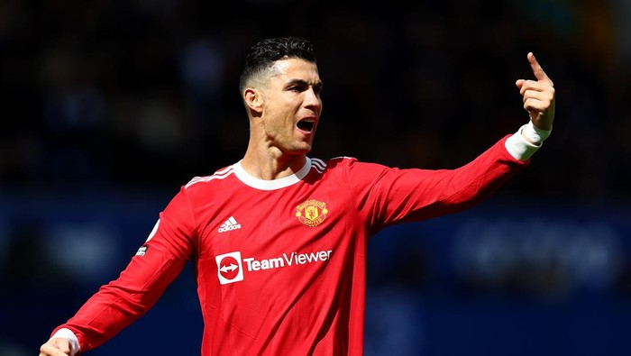

```{r setup, include=FALSE}
# clear-up the environment
rm(list = ls())

# chunk options
knitr::opts_chunk$set(
  message = FALSE,
  warning = FALSE,
  fig.align = "center",
  comment = "#>"
)

options(scipen = 9999)
```

# Goal Scorer

Cristiano Ronaldo is one of the best goal scorer in the world. He start playing as winger. Now, he mostly operated as forward. How the change in his position make him such a beast in front of the goal ? Let's find out by look at his data. We are going to look from his early day in Sporting Lisbon. Before Sir Alex Ferguson recruit him to Manchester United.

```{r}

```

# The Data

```{r}
# Read Data
cristiano <- read.csv('dataCristiano.csv')

anyNA(cristiano)
# Check Missing Value

# Check Null Value
is.null(cristiano)

```

Data looks good to use because no missing data or null. But let's explore more about the data we going to use. It's playing position.
<br>
<br>
```{r}
unique(cristiano$Playing_Position)
```

As we can see, we get data we can't use like "", "LW ", and "CF ". This going to mess with the result. Because there are two LW and two CF. We must change this so the data can be used in further analysis.
<br>
<br>
```{r}
# Change "" to NA
cristiano$Playing_Position[cristiano$Playing_Position == ""] = NA

# Change NA to appropiate data
library(tidyr)
cristiano <- cristiano %>% fill(Playing_Position, .direction = 'down')

# Change "LW " and "CF " to "LW" and "CF"
cristiano$Playing_Position <- sapply(X = as.character(cristiano$Playing_Position), FUN = switch,
       "LW " = "LW",
       "CF " = "CF",
       "RW" = "RW",
       "LW" = "LW",
       "CF" = "CF")

# Check the data 
unique(cristiano$Playing_Position)
```

Now, we only get LW, RW, and CF as unique value in Playing Position. This means good. We can use these data to analysis. Then we check data type. 
<br>
<br>
```{r}
str(cristiano)
```

Data Type still not suitable for analysis. We should change those to the right type.  
<br>
<br>
```{r}
# Change Data Type
cristiano[,c('Season','Competition','Club','Type','Goal_assist', 'Playing_Position')] <- lapply(cristiano[,c('Season','Competition','Club','Type','Goal_assist','Playing_Position')], as.factor)

# Change Date Data Type with Lubridate
library(lubridate)
cristiano$Date <- mdy(cristiano$Date)
```

We finish changing the data type. Now, we can analyze the data.
<br>
<br>

# Carreer

```{r}
head(cristiano)
```

Cristiano start play profesional football with Sporting Lisbon in 2002/2003 season. He started playing as Left Winger. His first goal against Moreirense FC by solo run and without assist from his teammates. This shows his potential as attacting winger.
<br>
<br>
```{r}
tail(cristiano)
```

The last goal, he played in premier league as Manchester United player, he played as Center Forward. His position change from winger to central forward. Is his changing position make him get more goal ? 
teammates. This shows his potential as attacting winger.
<br>
<br>

# His Goal and How He Score Them

Before we talk about his position, let's find out how he score the goal first.

```{r}
# Make Visualization from Type Goal
library(ggplot2)
goal <- table(cristiano$Type)
order_goal <- goal[order(goal)]
goal_df <- as.data.frame(order_goal)

ggplot(data = goal_df,las=2, mapping = aes(x = Freq, y = Var1, color = Var1 )) +
  geom_col(aes(fill = Freq), show.legend = F) +
  geom_label(aes(label = Freq), show.legend = F) +
  labs(
    title = "Cristiano's Type of Goals",
    subtitle = 'from 2002-2022',
    x = 'Goal Count',
    y = 'Type'
      ) +
  theme_light()
```

He scored the most from right foot. It make sense because right foot is his strong foot. He only score solo run two times. This make him more productive as finisher not dribble alone toward opponent's goal. He also scored a lot from header. So he can make goal from high and long crosses. 

His left foot shot get him 110 goal. So, he also dangerous whit his left foot. He practically deadly in front of the goal. He can score with right foot, left foot, and head. 

# His Position in Formation

```{r}
# Make Visualization from Type Goal and Playing Position
ggplot(data = cristiano, mapping = aes(x = Playing_Position, y = Type, color = Playing_Position)) +
  geom_jitter(aes(Fill = Playing_Position),show.legend = F)+
  labs(
    title = "Cristiano's Position in Scoring Goals",
    subtitle = "from 2002-2022",
    x = "Playing Position",
    y = "Type of Goal") +
  theme_light()
```

Cristiano score the most from right-footed shot and playing as Left Wing. Nowadays, there is spesific name for this kind of player, it's inverted winger.If a left-footed wide player plays on the right wing, or a right-footed player plays on the left wing, he is described as an inverted winger. Vice versa. This kind of player often move to center area than sideline. So, the chance to score going up. Especially, when the play style is utilise both wingers to create chance and make goal.
<br>
<br>
# Goal Count Development

```{r}
# Make Visualization from Season and Goal Gount

goal_season <- as.data.frame(table(cristiano$Season))
ggplot(data = goal_season, mapping = aes(x = Freq, y = Var1)) +
  geom_col(aes(fill=Freq), show.legend = F) +
  scale_fill_continuous(low = "orange", high = "red") +
  geom_label(aes(label=Freq)) +
  labs(
    title = "Goal Every Season",
    subtitle = "2002/2003 - 2021/2022",
    x = "Goal Count",
    y = "Season"
  ) +
  theme_light()

```

Ronaldo's top performance is in 2014/2015. He scored 61 goals. From the graphic, we can learn that he gradually increase his goals and peak at 2014/2015. But, unfortunately after that, his goals decreasing. Even though, he still scored a lot of goals.

# Conclucion

Cristiano Ronaldo is a great if not the best in the world. He is a good finisher in opponent area. His strongest weapon is right foot. But, his heading and left-footed shooting still produce many goals for his team. His peak perfomance at 2014/2015 with Real Madrid. This excellent performance bring Madrid win UEFA Super Cup and FIFA Club World Cup.  


